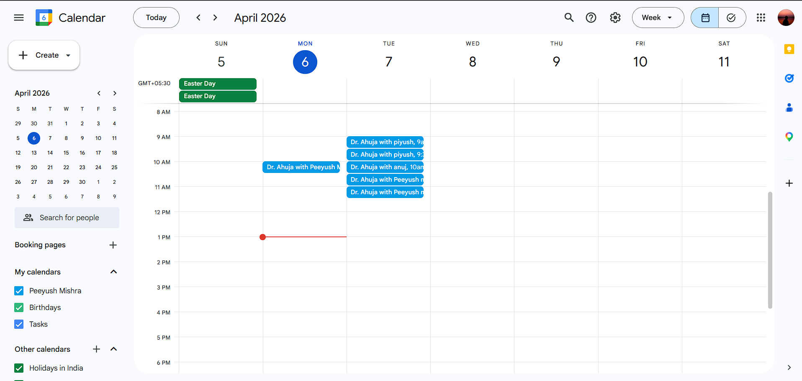
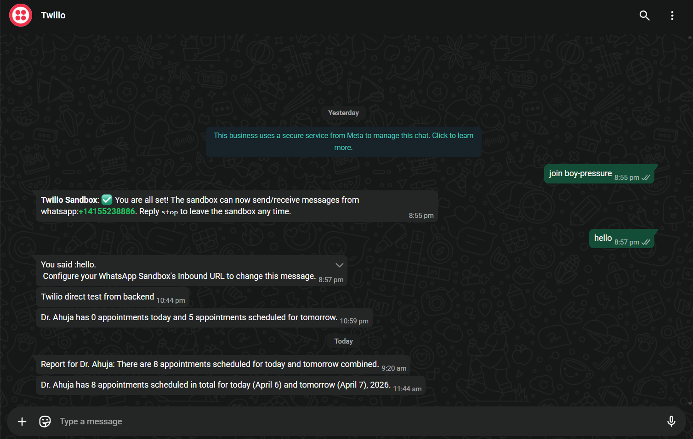

# Agentic Appointment Assistant (MCP + FastAPI + React)

A production-style demo project that shows how to build an MCP-first, tool-calling appointment assistant with clean code, modular design, and real integrations.

## What this project does

- Patient flow: check slots, book appointment, create Google Calendar event, send confirmation email.
- Doctor flow: generate summary report and send WhatsApp notification.
- Multi-turn continuity: persistent chat threads per logged-in user.
- MCP architecture: tools/resources/prompts exposed by MCP server and dynamically consumed by MCP client + LLM orchestrator.

## Clean code and modular structure

This repository follows clear module boundaries so each layer has a single responsibility.

### Backend modules

- `backend/app/main.py`
  - FastAPI app bootstrap, routers, middleware setup.

- `backend/app/api/`
  - `routes.py`: REST endpoints used by frontend.
  - `schemas.py`: request/response models for validation.

- `backend/app/core/`
  - `agent.py`: LLM orchestration loop with MCP tool-calling.
  - `integrations.py`: external integrations (Google Calendar, SendGrid, Twilio).
  - `config.py`: strongly typed environment configuration.
  - `auth.py`: token/password utilities.

- `backend/app/mcp/`
  - `server.py`: MCP JSON-RPC server (`tools/list`, `tools/call`, `resources/*`, `prompts/*`).
  - `client.py`: MCP client used by the orchestrator.

- `backend/app/db/`
  - `models.py`: ORM models for users, chats, appointments, etc.
  - `database.py`: database session and engine setup.

### Frontend modules

- `frontend/src/App.jsx`
  - Auth shell, role switching, demo doctor credentials, top-level layout.

- `frontend/src/components/ChatPanel.jsx`
  - Chat thread list, message view, send flow, tool-trace display.

- `frontend/src/api/client.js`
  - API request helpers and endpoint wrappers.

### Design principles used

- Separation of concerns: API, orchestration, MCP protocol, integrations, and UI are isolated.
- Minimal coupling: frontend only talks to REST API; orchestrator only talks to MCP client.
- Runtime tool discovery: no hardcoded tool contracts in agent logic.
- Defensive integration behavior: fallback modes and explicit status payloads.

## Project flow (end-to-end)

### Patient booking flow

1. User sends booking prompt in chat.
2. Frontend calls `POST /api/chat`.
3. Backend `agent.py` fetches MCP tools/prompts dynamically.
4. LLM calls:
   - `check_doctor_availability`
   - `book_appointment`
   - `send_patient_email`
5. `book_appointment` stores DB record and creates Google Calendar event.
6. Calendar event is now created with patient attendee invite (`sendUpdates=all`).
7. Assistant response + full tool trace returned to UI.

### Doctor reporting flow

1. Doctor asks for today/tomorrow report.
2. LLM calls `get_doctor_report_stats`.
3. LLM (or fallback auto-step) calls `send_doctor_notification`.
4. Twilio sends WhatsApp notification to env-configured doctor number only.
5. Delivery status/error details are returned in tool trace.

## Setup guide

### 1) Start PostgreSQL

Use Docker from project root:

```bash
docker compose up -d
```

Default DB expected by backend env:

- Database: `appointment_mcp`
- Update credentials in `backend/.env` as needed.

### 2) Backend setup

```bash
cd backend
python -m venv .venv
.venv\Scripts\activate
pip install -r requirements.txt
copy .env.example .env
```

Update `backend/.env` with at least:

- Core
  - `DATABASE_URL`
  - `OPENAI_API_KEY`
  - `OPENAI_BASE_URL` (if using provider-compatible endpoint)
  - `OPENAI_MODEL`

- Google Calendar
  - Recommended: `GOOGLE_REFRESH_TOKEN`, `GOOGLE_CLIENT_ID`, `GOOGLE_CLIENT_SECRET`
  - Optional fallback: `GOOGLE_ACCESS_TOKEN`
  - `GOOGLE_CALENDAR_ID`

- Email (SendGrid)
  - `EMAIL_PROVIDER=sendgrid`
  - `EMAIL_FROM`
  - `EMAIL_API_KEY`

- WhatsApp (Twilio)
  - `TWILIO_ACCOUNT_SID`
  - `TWILIO_AUTH_TOKEN`
  - `TWILIO_WHATSAPP_FROM`
  - `DOCTOR_WHATSAPP_TO`

Run backend:

```bash
uvicorn app.main:app --reload --host 127.0.0.1 --port 8000
```

### 3) Frontend setup

```bash
cd frontend
npm install
npm run dev
```

Open:

- Frontend: `http://localhost:5173`
- Backend health: `http://127.0.0.1:8000/api/health`

## Demo login credentials

- Doctor demo user
  - Email: `doctor@clinic.local`
  - Password: `doctor123`

## Sample prompts

### Patient prompts

- "Check Dr. Ahuja availability for tomorrow morning"
- "Book the 10:30 AM slot with Dr. Ahuja, my name is Alex, my email is alex@gmail.com"
- "What day is today and what slots are open in the afternoon?"

### Doctor prompts

- "How many appointments does Dr. Ahuja have today?"
- "Give me today and tomorrow summary for Dr. Ahuja and notify me"
- "How many appointments had fever yesterday?"

## API usage summary

### Authentication

- `POST /api/auth/register`
  - Patient registration + session token.

- `POST /api/auth/login`
  - Login for `patient` or `doctor` role.

- `POST /api/auth/logout`
  - Invalidates current auth token.

- `GET /api/me`
  - Returns current user profile from token.

### Chat and threads

- `GET /api/chats`
  - List current user chat threads.

- `POST /api/chats`
  - Create a new chat thread.

- `GET /api/chats/{chat_id}/messages`
  - Fetch message history and tool traces.

- `POST /api/chat`
  - Main assistant endpoint.
  - Request body:
    - `message` (string, required)
    - `chat_id` (string, optional)
  - Response body:
    - `chat_id`
    - `response`
    - `tool_trace` (tool calls + results)

### MCP endpoint

- `POST /mcp` (JSON-RPC)
  - Methods:
    - `initialize`
    - `tools/list`
    - `tools/call`
    - `resources/list`
    - `resources/read`
    - `prompts/list`
    - `prompts/get`

## Integration notes

### Google Calendar

- Events are created in configured calendar (`GOOGLE_CALENDAR_ID`).
- Patient email is added as attendee, and invite update is requested.
- Recipient visibility may depend on invite acceptance and mailbox filtering (Spam/Promotions).

### Twilio WhatsApp

- Current doctor notification target is env-only (`DOCTOR_WHATSAPP_TO`).
- In sandbox mode, target number must join the Twilio sandbox first.

## Screenshots

### Prompt-based appointment booking



### Notification to doctor (WhatsApp)



